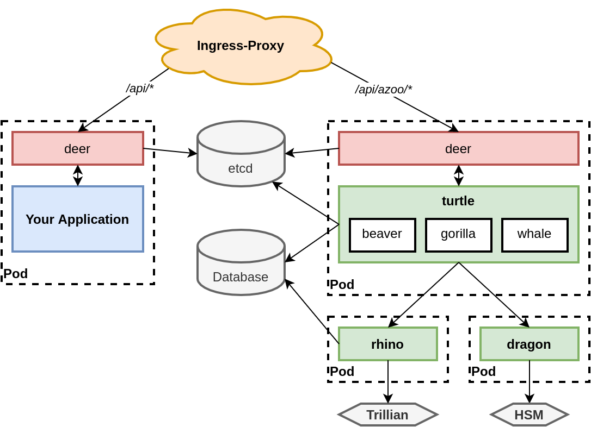
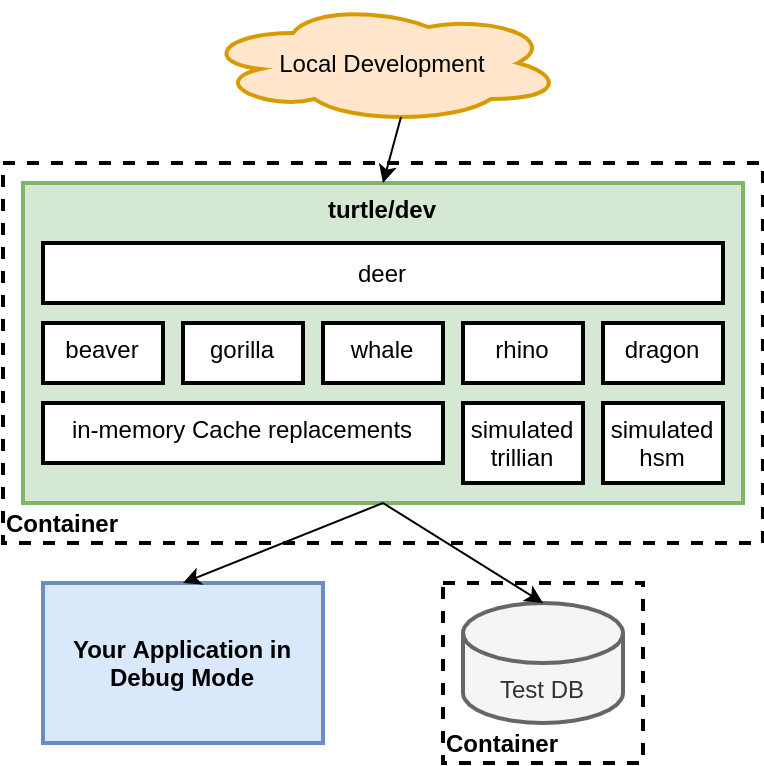
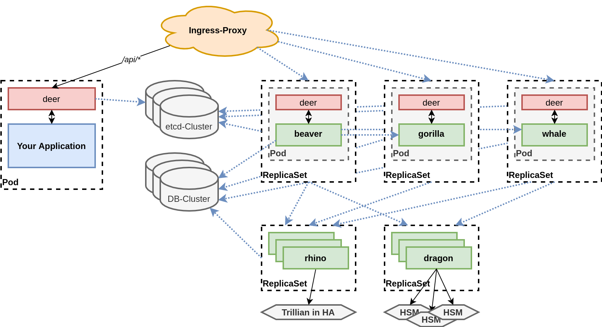

# azoo
azoo is a headless [ASVS Level 3](https://owasp.org/www-project-application-security-verification-standard/) Identity and Access Management (IAM) system built for a cloud-native environment

  <table>
    <tbody>
    <td align="center">
       
      Status: <b>⚠️ In development</b> 
      This is a partial rewrite of libraries and services developed since 2016 for all kinds of different projects from <a href="https://github.com/harwoeck">Florian Harwoeck</a>. The goal is a self-contained project that doesn't depend on all my internal generators and helpers, but rather only uses open-source software. This should improve code quality, maintainability and make it easier and faster to use in new projects without my handcrafted skeleton and without Go as a language-requirement.  
      During the rewrite some core technologies are switched out and replaced (for example from <a href="https://grpc.io/">GRPC</a> to <a href="https://twitchtv.github.io/twirp/docs/intro.html">Twirp</a>, from <a href="https://www.vaultproject.io/">Vault</a> to <a href="./utils/dvx">Dragon-DVX</a>, etc.) so this project can be easily integrated in a wider variaty of systems. Furthermore many design decisions are revised slightly to achive <strong>ASVS Level 3 "readiness"</strong>.
      
    </td>
    </tbody>
  </table>

- Should include [CII-Best-Practices](https://bestpractices.coreinfrastructure.org/en) badge when finished
- Should include License badge
- Should include pkg.go.dev badge
- Should include Documentation badge to GitBook

## Features

- Handles all aspects of Customer Identity and Access Management (CIAM) with an API-first (headless) approach and no reliance/dependency on any template or theming engine. Things taken care of for you are:
  - managing credentials such as passwords, recovery tokens, etc.
  - user identifiers such as username, email, etc. in a blind-indexed lookup store
  - authentication (user identifier + password) including support for secure MFA options (TOTP and WebAuthn FIDO2)
  - authorization and role management (using RBAC rules with domain-tenant support)
  - keeping track of sessions (and their immediate revocation)
  - selfservice management for identities (updating their names, profiles, add/remove emails, usernames, passwords, etc.). With configuration options to disable selfservice on individual attributes.
  - providing admin endpoints for managing other identities
- Modular and easily extensible
- Easy to scale horizontally or run in a highly-available mode
- Ability to run without external components (load-balancers, caches, etc.) and as a single integrated dev-container for local development
- Small footprint - Go binary inside a scratch container (~10mb)
- Documentation for easy setup inside a K8S environment with [service meshes](https://servicemesh.es/) like [Linkered](https://linkerd.io/)

## Introduction

_azoo_'s main architectural components:

- 🦌 **deer**: Custom HTTP1.1, HTTP2 and gRPC proxy that should be used as a Sidecar to your application. It authenticates and authorizes requests and annotates them with meta-information (Trace-Id, [`Passport`](), etc.) for downstream consumers.
- 🐢 **turtle**: Library for merging different _azoo_ services into a single executable, while connecting them to themselves and their surroundings properly.
- 🦫 **beaver**: authentication as a service
  - responsible for storing credentials / tokens / etc. and match them to a user-id
  - users can authenticate with beaver and receive authentication tokens
- 🦍 **gorilla**: authorization as a service
  - internally wraps a [Casbin](https://casbin.org/) server for RBAC (with Tenants) authorization management
  - users can receive and update roles
- 🐋 **whale**: identity & user management service
  - responsible for storing user information. Only service that stores PII (personal identifiable information)
  - users can receive and update their information
- 🦏 **rhino** cryptographically verifiable append-only log system
  - stores [security log events](https://cheatsheetseries.owasp.org/cheatsheets/Application_Logging_Vocabulary_Cheat_Sheet.html) in a KV-store
  - appends hash-chain-like hashes to [Trillian](https://github.com/google/trillian)
  - provides CLI tool to import last X events into ELK (or other [SIEM](https://en.wikipedia.org/wiki/Security_information_and_event_management)) (and verify their integrity with Trillian)
- 🐉 **dragon**: cryptography as a service
  - Twirp service around a [`dvx.Protocol`](./utils/dvx) instance
  - Creates a seperation of concern for secret-key management and implements clear boundary-boxes from which secrets never leave.
  - Provides Encryption, Decryption, Signing, Verification, MAC and TOTP as-a-service.
  - Derives secret keys from an internal root-secret or a hardware-security-module HSM (via PKCS#11) using key-ring identifieres
  - Protects it's memory using [`mlockall(2)`](https://linux.die.net/man/2/mlockall)

### Modularity

Because _azoo_ is built in a highly modular architecture it can be run in a variety of different configurations, while only changing small parts of initialization code or configuration values:

<table>
<tbody>
  <tr>
    <th><strong>Recommended production mode</strong></th>
    <th><strong>Local Development mode</strong></th>
  </tr>
  <tr>
    <td></td>
    <td></td>
  </tr>
  <tr>
    <th><strong>Highly-Available deployment</strong></th>
    <th><strong>...</strong></th>
  </tr>
  <tr>
    <td></td>
    <td><ul><li>Don't like <i>dragon</i>? Switch it out ...</li><li>Want to run only <i>beaver</i> in HA-mode? Just a configuration away ...</li><li>Would like to use managed services like <a href="https://aws.amazon.com/solutions/implementations/centralized-logging/">AWS Centralized Logging</a> instead of <i>rhino</i>? Only need to write a few lines of Go-code to wrap your product in an <code>rhino.Rhino</code> interface and provide it as an <a href="https://pkg.go.dev/go.uber.org/fx">fx</a>-Module</li></ul>Use the <strong>Discussions</strong> tab to ask questions about and get help for your deployment strategy</td>
  </tr>
</tbody>
</table>
