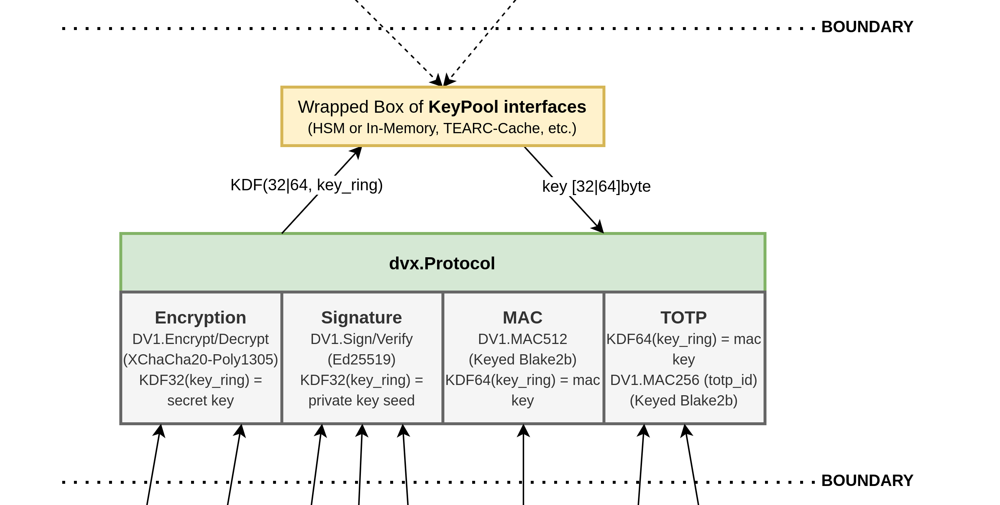

# dvx

Package dvx provides an easy-to-use interface to a Cryptography service, that uses state-of-the-art primitives. It provides 4 main categories of supported operations: Encryption/Decryption, Signing/Verifying, MAC, and as a special higher-order algorithm: TOTP Creation/Verification.


(See the picture of the complete architecture [here](./docs/dvx.png))

## Specification

### Encoding

dvx has built-in support for upgrading the underlying cryptographic primitives used. It therefore introduces its packaging format for results from a [`dvx.Protocol`]() instance:

```
<version>.<type_prefix>.<data>
```

1. Version: Is the version of the underlying primitives and the way how keys are derived from the [`KeyPool`]() for there respective primitives.
2. TypePrefix: Is the identifier of the module used: `"enc"`, `"sig"`, `"tag"` or `"totp"`
3. Data: is the raw data (e.g. encrypted content, signature, mac tag, etc.) represented as base64 url string without padding append ("Raw" encoding).

### Primitives

#### dv1

- **Authenticated Encryption:** XChaCha20-Poly1305 (192-bit random nonce, 256-bit key, 128-bit authentication tag)
  1. Generate 24 random bytes using a CSPRNG as `nonce`
  2. Pack `"dv1"` version string and `nonce` into AEAD-additional data (`append([]byte("dv1"), nonce...)`)
  3. Use AEAD construction with `key`, `nonce`, `message`, `additional_data`
- **MAC:** Keyed Blake2b (512-bit key, 256-|512-bit tag)
- **Signatures:** Ed25519 (EdDSA over Curve25519)
- **Key Derivation:** Argon2id (512-bit derived key)

##### Further reading

A few links and resources that should explain why the selected primitives where chosen for **dv1**

- General:
  - https://loup-vaillant.fr/articles/crypto-is-not-magic
  - https://latacora.micro.blog/2018/04/03/cryptographic-right-answers.html
  - https://paragonie.com/blog/2019/03/definitive-2019-guide-cryptographic-key-sizes-and-algorithm-recommendations
  - https://monocypher.org/
- XChaCha20-Poly1305:
  - https://doc.libsodium.org/secret-key_cryptography/aead/chacha20-poly1305/xchacha20-poly1305_construction
  - https://datatracker.ietf.org/doc/html/rfc8439
  - https://monocypher.org/manual/aead
  - https://crypto.stackexchange.com/questions/91945/xsalsa20poly1305-for-encryption-at-rest
  - https://github.com/paseto-standard/paseto-spec/blob/master/docs/01-Protocol-Versions/Version2.md
  - https://github.com/paseto-standard/paseto-spec/blob/master/docs/Rationale-V3-V4.md#no-more-nonce-hashing-change
- Blake2b:
  - https://doc.libsodium.org/hashing/generic_hashing
  - https://datatracker.ietf.org/doc/html/rfc7693
  - https://monocypher.org/manual/hash
  - https://github.com/zcash/zcash/issues/706#issuecomment-187807410
- Ed25519:
  - https://doc.libsodium.org/public-key_cryptography/public-key_signatures
  - https://datatracker.ietf.org/doc/html/rfc8032
  - https://monocypher.org/manual/sign
- Argon2id:
  - https://www.password-hashing.net/
  - https://doc.libsodium.org/password_hashing
