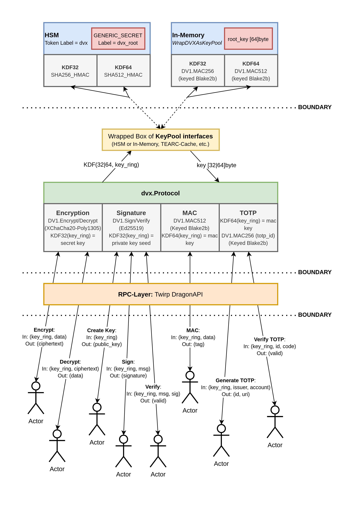

# hsm

Package _hsm_ is part of [azoo.dev/utils/dvx](https://pkg.go.dev/azoo.dev/utils/dvx), but has its own Go module. It provides a [`KeyPool`](https://pkg.go.dev/azoo.dev/utils/dvx#KeyPool) implementation that derives keys from a PKCS#11 Hardware-Security-Module (HSM) using SHA256-HMAC and SHA512-HMAC.

## Architecture

